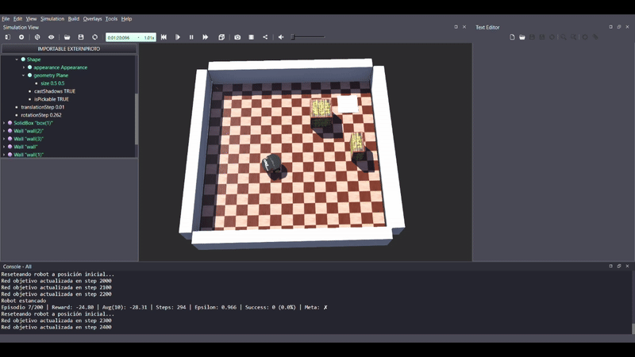
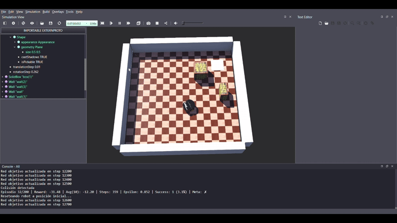
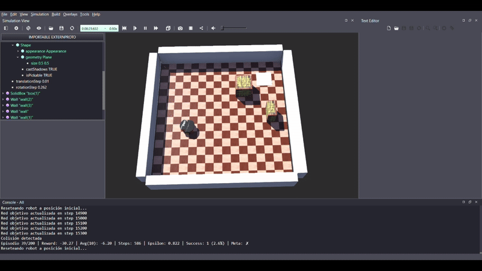

# Deep Q-Network con CUDA en Webots

Se implementa una **Deep Q-Network (DQN)** acelerada con **CUDA**, entrenando un agente dentro del simulador **Webots** para que pueda alcanzar una meta. 
---

## Tecnologías 

- **Webots** (simulación física del entorno).  
- **CUDA** (GPU computing).  
- **PyTorch** con backend CUDA.  
- **DQN clásico** (red Q-funcional + target network).  

---
## Entrenamiento

